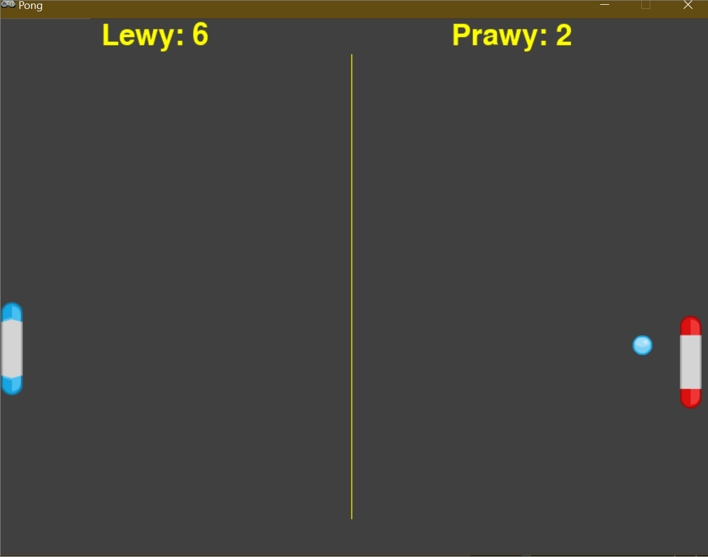

# Pong in Pygame Zero

A small educational Pong project built with [Pygame Zero](https://pygame-zero.readthedocs.io/). It is designed to show how a simple arcade game can be structured with a compact game loop, sprite actors, collision handling, scoring, and win conditions.



## What This Project Covers

- Creating a basic 2D game with Pygame Zero
- Moving player paddles with keyboard input
- Updating a ball with velocity on both axes
- Handling wall and paddle collisions
- Tracking score and ending the match when a player wins

## Gameplay

Two local players control paddles on the left and right side of the screen. The ball bounces off the top and bottom borders and reverses direction when it hits a paddle. If the ball leaves the screen on one side, the other player scores a point. The first player to reach 11 points wins.

## Controls

| Player | Up | Down |
| --- | --- | --- |
| Left paddle | `W` | `S` |
| Right paddle | `Up Arrow` | `Down Arrow` |

## Requirements

- Python 3.10+
- Pygame Zero

## Run The Game

1. Create and activate a virtual environment if you want an isolated setup.
2. Install Pygame Zero:

```bash
pip install pgzero
```

If there are issues with the installation for newer Python versions, you may need to install Pygame Community Edition, numpy, and then Pygame Zero with the `--no-deps` flag:

```bash
pip install pygame-ce numpy
pip install pgzero --no-deps
```

3. Start the game from the project root:

```bash
python main.py
```

## Project Layout

```text
.
├── images/
│   ├── ball.png
│   ├── left.png
│   ├── right.png
│   └── bonus.png
├── main.py
├── pongGame.gif
└── README.md
```

## Code Overview

The game logic lives entirely in `main.py`.

- Configuration constants define screen size, colors, margins, and the target score.
- Three `Actor` objects are used for the left paddle, right paddle, and ball.
- `draw()` renders the court, sprites, score, and end-of-game message.
- `update()` advances the game state while the match is still active.
- Helper functions keep movement, collisions, scoring, and reset logic separated into small pieces.

This makes the project easy to read and a good starting point for learning how game state changes over time.

## Ideas For Extension

- Add sound effects for paddle hits and scoring
- Add a start screen and restart option
- Increase ball speed over time
- Replace one paddle with a simple AI opponent
- Add visual effects such as particle trails or screen shake

## Corresponding Tutorial

A step-by-step tutorial that builds this project from scratch is available on the [CS-HTIEW](https://edu.cs-htiew.pl/learning-by-games/python/pygame-zero/pong/) website. It covers the same concepts in more detail and is a great resource for beginners.

## Credits

- Sprite assets: [Kenney](https://kenney.nl)

## License

This project is distributed under the MIT license included in [LICENSE](LICENSE).